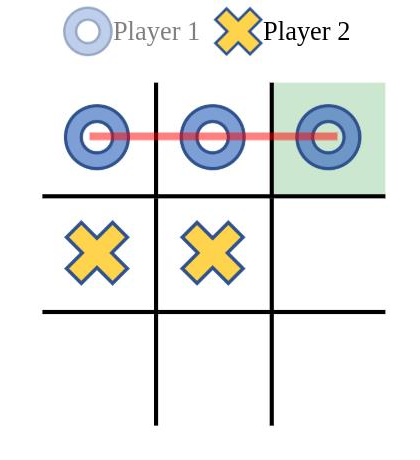
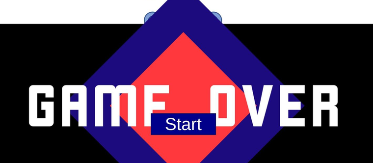

# Tic Tac Toe

[](https://codecov.io/gh/Mario-Mohar/TicTacTo)

A tic tac toe game for two players at one screen. No build step, no dependencies,
no server: three files and three images.

**▶ [Play it here](https://mario-mohar.github.io/TicTacTo/)**

**[English](#english) · [Deutsch](#deutsch)**

<p align="center">
  
  &nbsp;&nbsp;
  
</p>

---

# English

## Playing

Two players share one screen. Player 1 is the circle and starts, player 2 is the
cross; the header shows whose turn it is. Click a free field to place your mark.
Taken fields ignore further clicks.

Three in a row, in a column or across a diagonal draws a line through the winning
fields and ends the round. If all nine fields are filled without a line, the round
is a draw. Either way the **Start** button appears and begins a new round.

## Running it yourself

There is nothing to install. Open `index.html`, or serve the folder:

```bash
python3 -m http.server 8000
# then open http://localhost:8000
```

## How it is built

Plain HTML, CSS and JavaScript, no framework and no build. The board is a table
with nine cells; every cell holds a hidden circle and a hidden cross image, and a
click reveals one of them. The winning line is a pre-placed `div` that gets scaled
from zero to full width, which is why the stroke appears to be drawn.

An early exercise project. It is published as it was written, not modernised
afterwards.

## Licence

MIT, see [LICENSE](LICENSE).

---

# Deutsch

## Spielen

Zwei Spieler an einem Bildschirm. Spieler 1 ist der Kreis und beginnt, Spieler 2
ist das Kreuz; oben steht, wer dran ist. Ein Klick auf ein freies Feld setzt das
Zeichen. Belegte Felder ignorieren weitere Klicks.

Drei in einer Reihe, Spalte oder Diagonale zieht eine Linie durch die
Gewinnfelder und beendet die Runde. Sind alle neun Felder voll, ohne dass eine
Linie zustande kommt, ist die Runde unentschieden. In beiden Fällen erscheint der
**Start**-Knopf und beginnt eine neue Runde.

## Selbst starten

Es gibt nichts zu installieren. `index.html` öffnen, oder den Ordner ausliefern:

```bash
python3 -m http.server 8000
# dann http://localhost:8000 aufrufen
```

## Wie es gebaut ist

Reines HTML, CSS und JavaScript, kein Framework und kein Build. Das Spielfeld ist
eine Tabelle mit neun Zellen; in jeder liegen ein verstecktes Kreis- und ein
verstecktes Kreuzbild, ein Klick blendet eines davon ein. Die Gewinnlinie ist ein
vorplatziertes `div`, das von Breite null auf volle Breite skaliert wird, deshalb
sieht es aus, als würde der Strich gezogen.

Ein frühes Übungsprojekt. Es ist so veröffentlicht, wie es geschrieben wurde,
nicht nachträglich modernisiert.

## Lizenz

MIT, siehe [LICENSE](LICENSE).

## Contributing

Bug reports, feature requests and pull requests are all welcome — finding
something that is broken and writing it down is a real contribution, and the
most useful one.

**[CONTRIBUTING.md](CONTRIBUTING.md)** has the details: what makes a report
useful, how to send a fix through a fork, and what happens after you submit.
